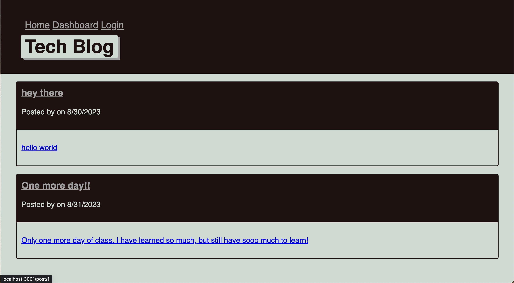
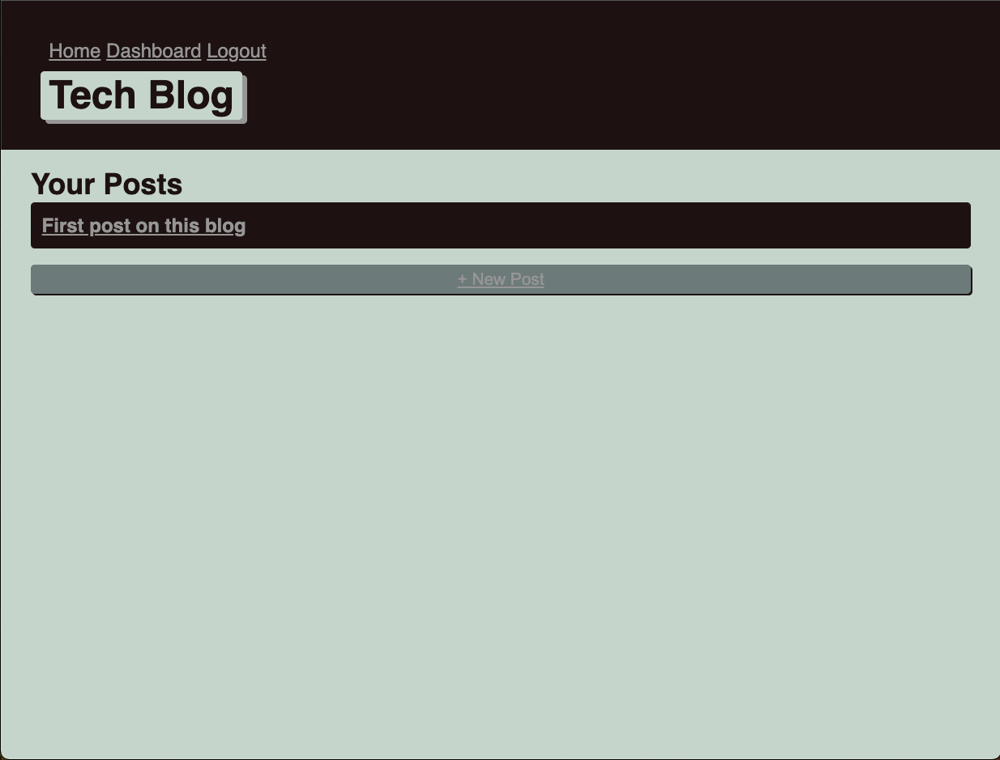
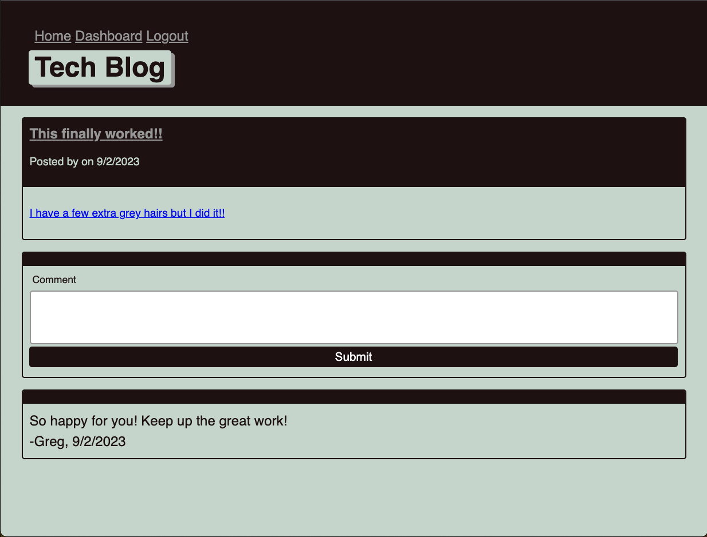

# Tech-Blog

<details>
    <summary><h2>Table of Contents</h2></summary>

- [Tech-Blog](#tech-blog)
  - [Description](#description)
  - [License](#license)
  - [Technologies Used](#technologies-used)
  - [Screenshots](#screenshots)
  - [Deployed Application](#deployed-application)
  - [Installation](#installation)
  - [Acknowledgements](#acknowledgements)
  - [Contributors / Contact Info](#contributors--contact-info)

</details>

## Description

The application was designed to allow users to blog their thoughts and ideas. It allows other users to view the posts and add comments to them. The structure follows the Model View Controller (MVC) paradigm and utilizes Handlebars.js for the template language. 

## License

None

## Technologies Used

     

## Screenshots

Homepage Image  User Dashboard  Comment Page 

## Deployed Application

View the deployed application here ➡️  [Heroku Deployment](https://peaceful-springs-77627-03d7052ca0da.herokuapp.com)

## Installation

First you will need to verify that you have Node.js and MySQL installed on your machine.

Next you will need to clone the repository using:

```terminal
git clone https://github.com/JonJonS06/Tech-Blog.git
```

Next you will need to install the dependencies:

```terminal
npm init --y
```

```terminal
npm install
```

Open MySQL shell in the terminal and enter:

```terminal
source db/schema.sql;
```

Once that is complete you will "quit" to exit out of MySQL.

To start the server listening:

```terminal
node server.js
```

## Acknowledgements

Thank you as always to our Bootcamp instructor and TA's for the instruction and guidance.

## Contributors / Contact Info

Please feel free to contact me with any questions or suggestions at [jonjon1106@gmail.com](mailto:jonjon1106@gmail.com) or you can view my other projects at [Jonathan Strickland](https://github.com/jonjons06)

[🔼 Back to Top](#tech-blog)
